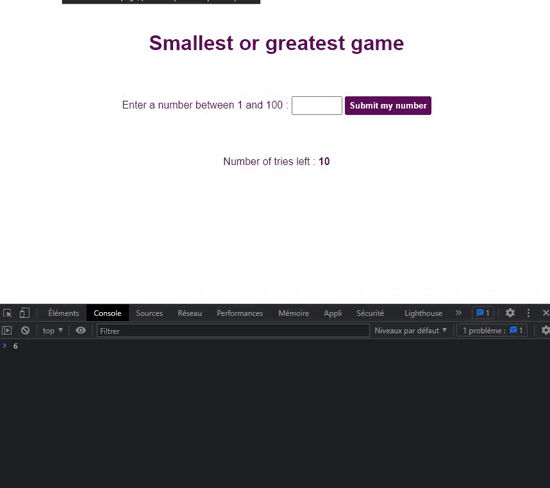

# Smallest or biggest number guessing game

## **Résumé**

Un petit jeu en javascript (Vue.js) permettant à un·e utilisateur·ice de deviner un nombre en lui donnant simplement un indice ("plus petit" ou "plus grand"). La personne a 10 essais pour trouver un nombre compris entre 1 et 100, après quoi, elle aura perdu.

## **Démo**

## **Utilisation de**

## **Fonctionnalités**

- Génération aléatoire d'un nombre à chaque début de partie ;
- Soumission d'un nombre ;
- Notification de victoire et de défaite ;
- Nouvelle partie après la fin d'une partie ;
  
- A la soumission d'une donnée, il y a une vérification pour :
  - le type de donnée fourni (de type nombre, null, texte) ;
  - le nombre fourni est bien compris en 1 et 100 ;
  - le nombre est plus petit, plus grand ou égal au nombre généré aléatoirement ;
  - savoir s'il reste des essais au joueur / à la joueuse ;
